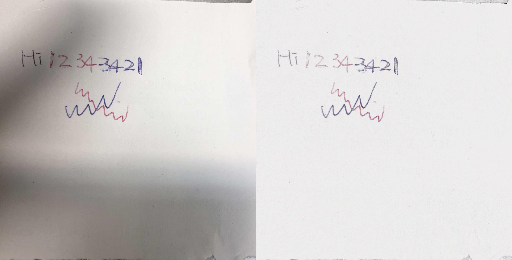
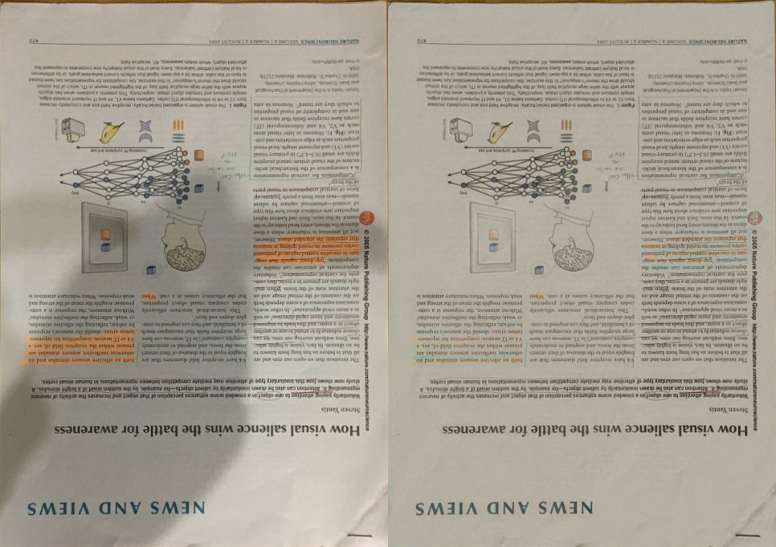
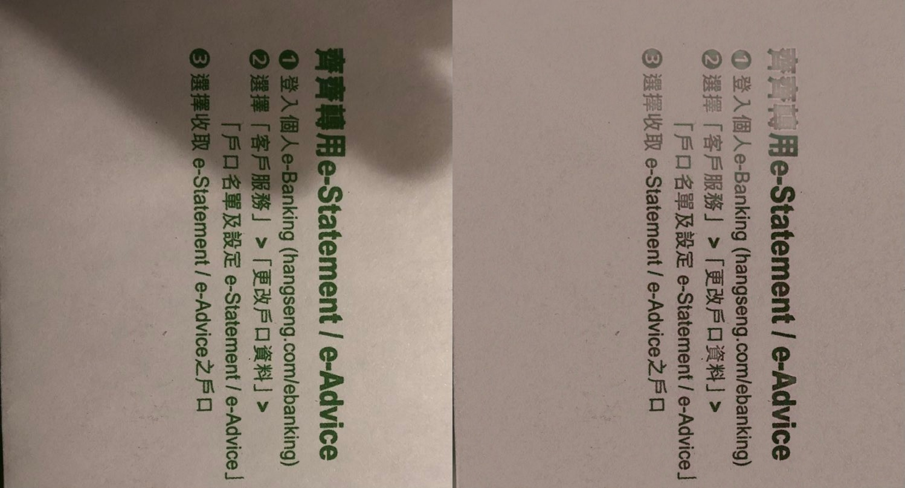
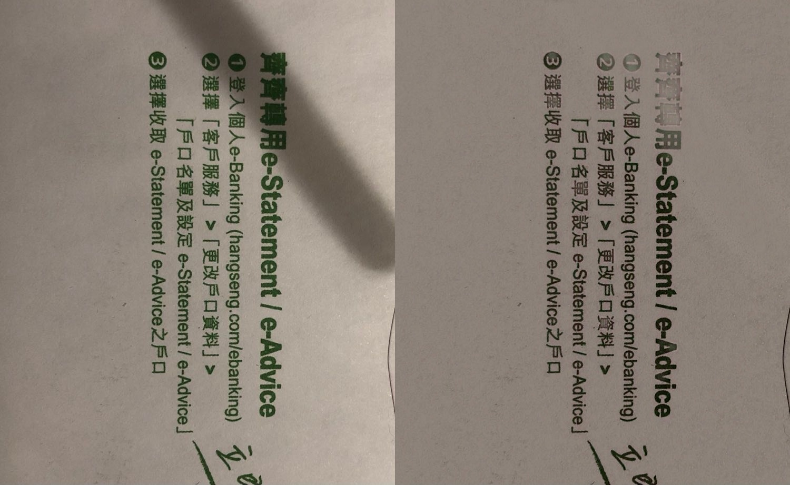
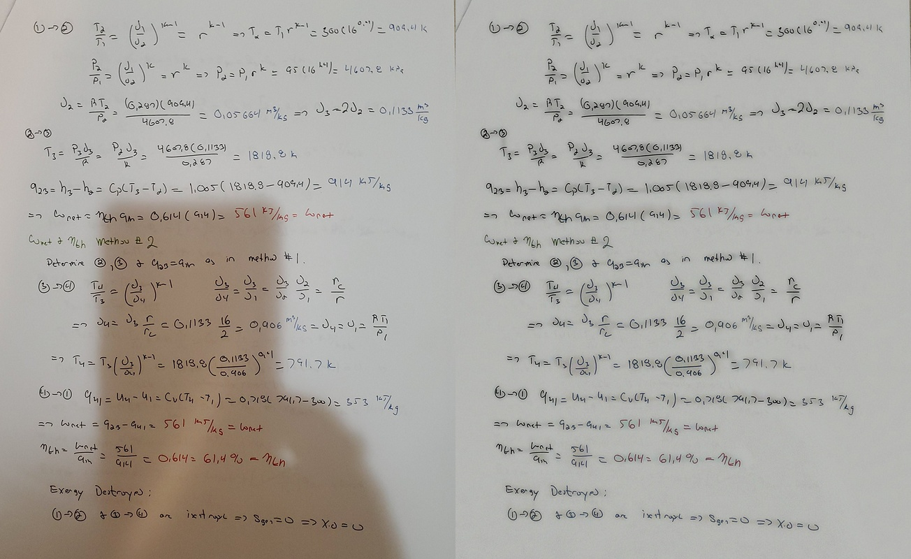

# Shadow Removal

## Description
In our study, we propose an effective image-processing-based algorithm to tackle shadow removal on colored text problems. Our algorithm can remove the majority of shadows for most damaged images while retaining the original color of text. 

## Steps
Generally, our proposed algorithm is composed of three stages. First, we perform shadow detection by MaxMin() algorithm on each channel of input image I(c, x, y). Next, subtract the input image with the shadow mask by ShadowRemove(). Eventually, restore the histogram by HistogramRestore() and merge the result of the three-channel back to the RGB domain.

## Requirements
[Python requirement](./README.md)

## Result
1 

2 

3 

4 

5 

6 